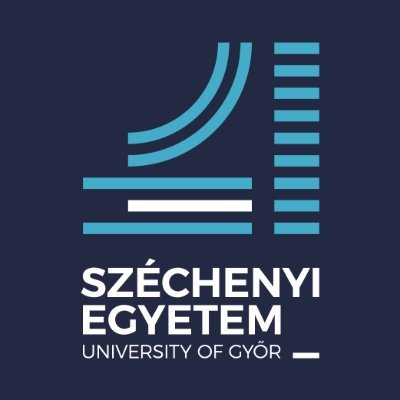
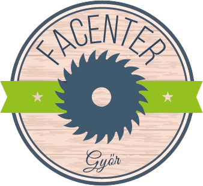

# WRO Future Engineers 2026

## Introduction

We're team Bits from Hungary, competing in the WRO Future Engineers category. This engineering documentation covers all major aspects of the robot's development: mobility management, power and sensor systems, obstacle detection, avoidance and construction design.

### Team members:

 - András Erdélyi
 - Balázs Erdélyi

### Coach:

 - Norbert Boros

## Abstract

Our solution is an autonomous robot built around a Raspberry Pi 5 programmed in Python and C++, responsible for the main challenge logic and vision processing, and an Arduino Nano, responsible for low-level tasks such as motor and servo control. We use a 360° RPLIDAR A2M8 combined with the gyroscope of a BNO055 IMU to track the robot's position and heading. Traffic signs are detected with a USB camera. Steering uses a HS-485HB servo with positive Ackermann geometry. Driving is powered by one N20E-12-500 DC motor and a DRV8871 H-bridge, through a rear-axle differential with a custom 3D-printed housing. The compact dual-plate chassis is powered by a custom 3S 18650 battery pack with a BMS and buck converters.

## Table of Contents

- ### Videos

    - [**Open Challenge**](https://www.youtube.com/watch?v=D1SUvafeCVA)
    - [**Obstacle Challenge**](https://youtu.be/72qxD-1WuEM)

- ### Hardware
    -  [**Assembly Overview**](docs/hardware/assembly-overview.md)
    -  [**Drive System**](docs/hardware/drive-system.md)
    -  [**Processing Units**](docs/hardware/processing-units.md)
    -  [**Sensors**](docs/hardware/sensors.md)
    -  [**Power and Electronics**](docs/hardware/power-and-electronics.md)
    -  [**Circuit Design**](docs/hardware/circuit-design.md)
    -  [**Cost of the Robot**](docs/hardware/cost-of-the-robot.md)
    -  [**3D Print**](docs/hardware/3d-print.md)
    -  [**Assembly Guide**](docs/hardware/assembly-guide.md)

- ### Software
    -  [**Architecture Overview**](docs/software/architecture.md)
    -  [**Components**](src/rpi/components/README.md)
    -  [**Control / Blackboard**](src/rpi/control/README.md)
    -  [**Processors & Planning Algorithm**](src/rpi/processors/README.md)
    -  [**Recording & Replay**](src/rpi/recording/README.md)
    -  [**Visualizers**](src/rpi/visu/README.md)
    -  [**Arduino Firmware**](src/arduino/README.md)
    -  [**Calibration**](calibration/README.md)
    -  [**Previous Approaches**](docs/software/previous-approaches.md)
    -  [**Developer & Setup Guide**](docs/software/setup-guide.md)

## Special Thanks

We'd like to thank Széchenyi István University, Facenter Kft., and Filasin for supplying us all the equipment that made our preparation possible.

<table>
<tr>
<td valign="top" width="240"></td>
<td valign="top" width="240"></td>
<td valign="center" width="240"></td>
</tr>
</table>
