# Assembly Guide

Print out each part with the right material:

- Top and bottom plates: ABS
- Every other part: PETG

For printing out the parts we used the base Bambu settings, since they're already decent enough.

**Important Note** Use a soldering iron to put the inserts into the 3D printed parts based on the pictures given.

**Recommended temperatures**
- PLA: 130 °C
- PETG: 180 °C
- ABS: 200 °C

**Legend**
- Blue: Part name
- Red: Size of the inserts and screws

**Tip**

If the printed parts come apart parallel to the layers, then try to print them using a 35-55°  tilt or a different infill pattern, which will give it more structural rigidity.

# Pictures

## Bottom Plate

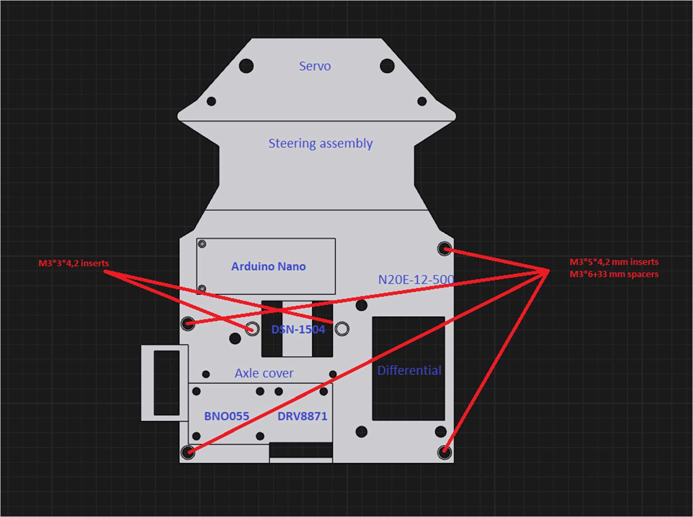

## Differential Housing

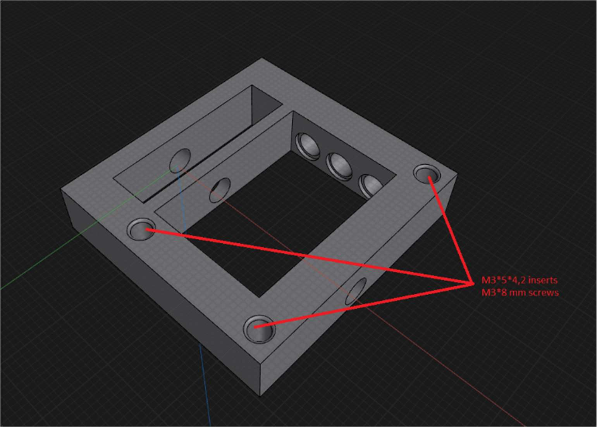

## Servo Holder

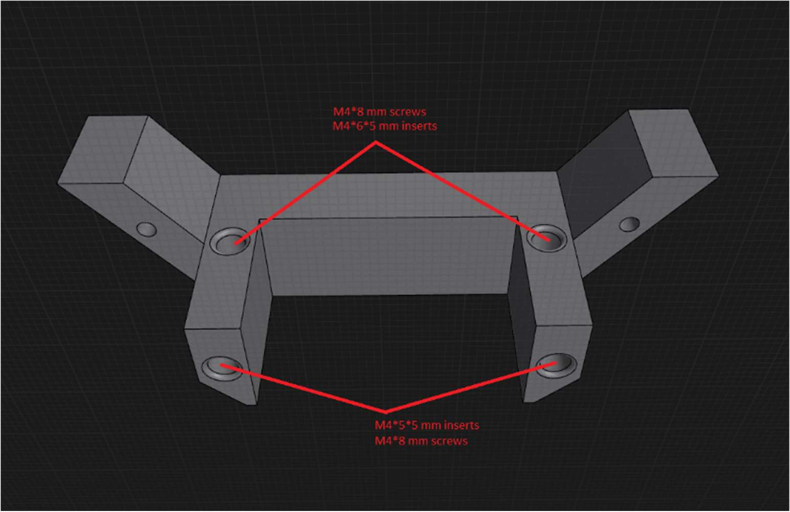

## DC Assembly

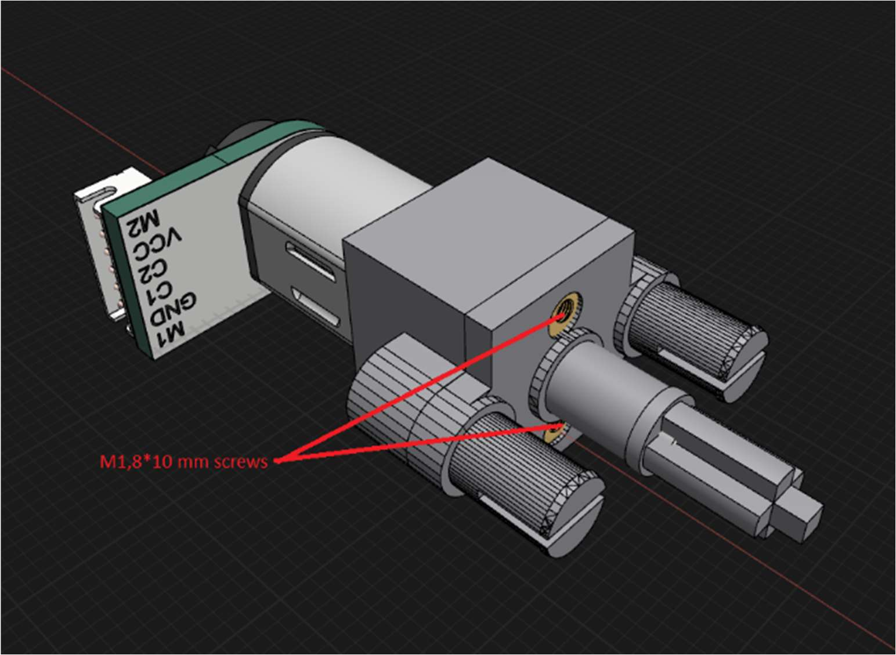

## Arduino Holder

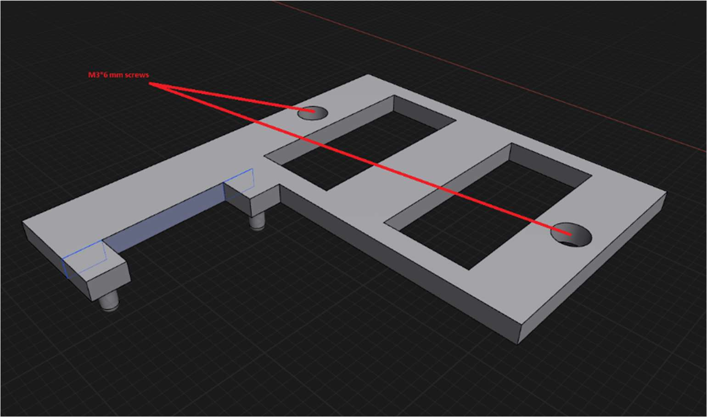

## Axle Cover

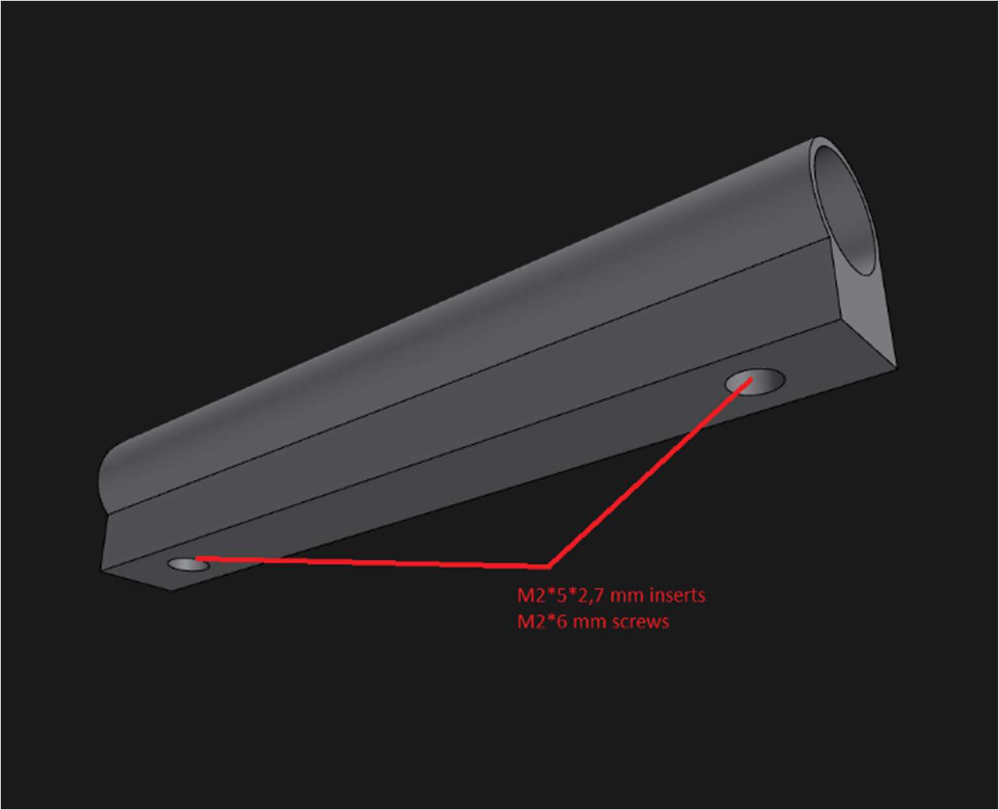

## Steering Assembly

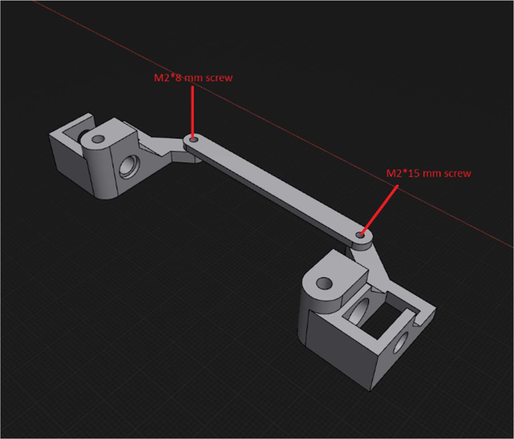

## Fully Assembled Bottom Part

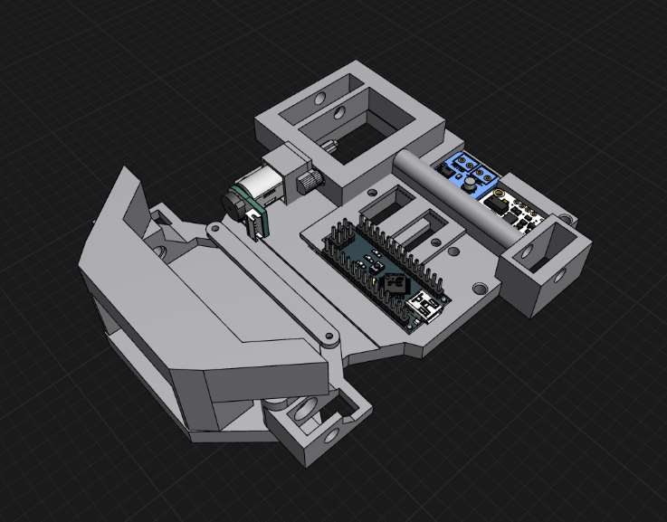

## Top Plate

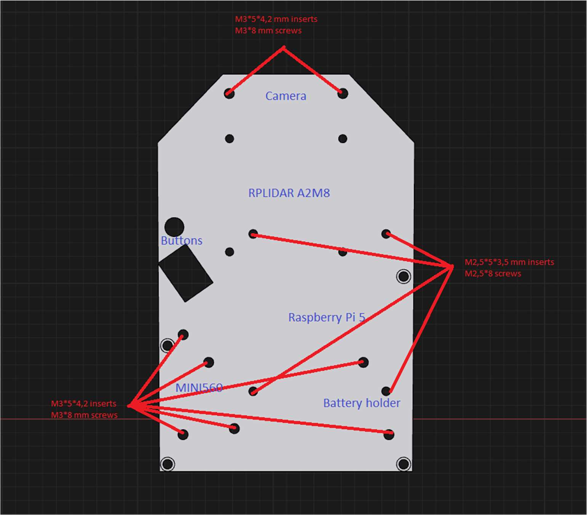

## Lidar Holder

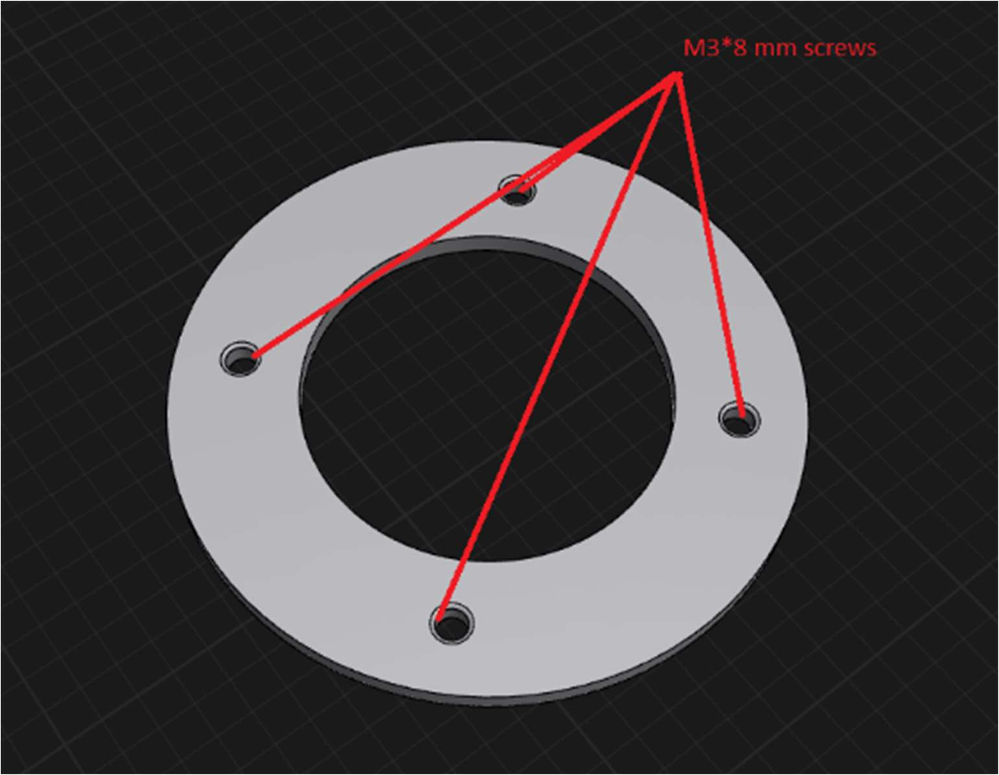

## Stepdown Holder

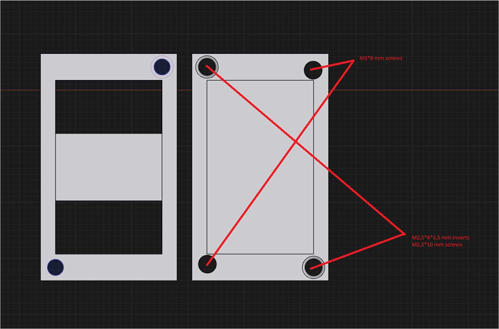

## Cam Holder

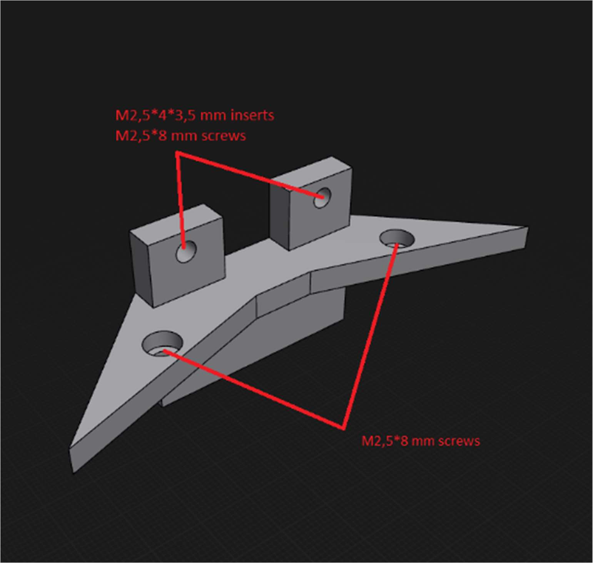

## Battery Holder

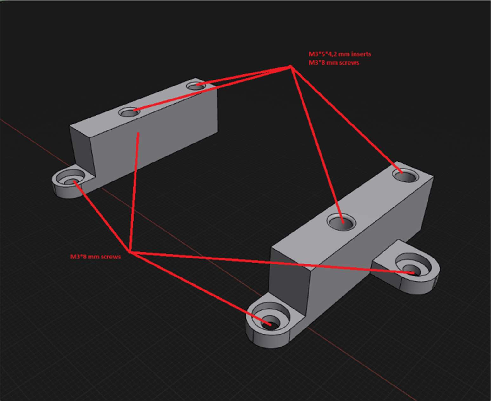

## Assembled Robot

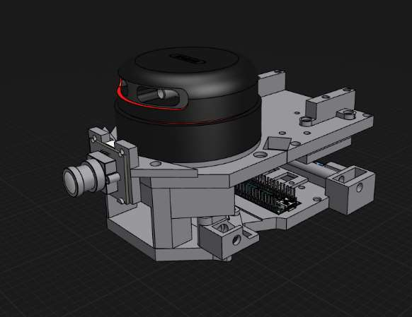
