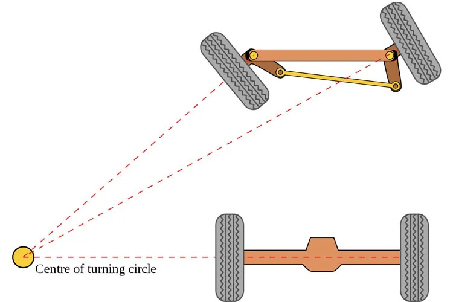

# Assembly Overview

Our robot utilizes positive Ackermann steering geometry, differential drive, and a multi-plate design.

### Chassis Architecture: Multi-Plate Design

The robot employs a dual-plate chassis architecture, separating the vehicle into two functional layers connected by standoffs: a bottom plate and a top plate.

- **Top plate** — carries the sensor suite responsible for perception (vision) and the battery pack.
- **Bottom plate** — houses the complete drive system (drive motor, differential, motor controller, IMU) along with the steering mechanism, which uses positive Ackermann geometry paired with differential drive on the rear axle.

This functional separation was a deliberate design choice: by isolating the drivetrain and its associated electronics from the sensor and power systems, individual subsystems can be accessed, diagnosed, and repaired independently without requiring disassembly of the entire chassis. This modularity reduces downtime during testing and competition, where rapid fault isolation and repair are critical.

### Ackermann Steering

Ackermann steering geometry is a geometric arrangement of linkages in the steering of a car or other vehicle designed to solve the problem of wheels needing to trace circles of different radii when turning.

**The problem it solves**
When the robot turns into a corner, the inside wheels travel along a tighter path than the outside wheels. Because the inside wheel is closer to the center of the turn, it must turn at a sharper angle than the outside wheel. If both wheels turned at the exact same angle, the tires would scrub, slide sideways, and cause unnecessary wear and tear.

**How it works**
Ackermann steering achieves the correct angles by angling the steering arms inward.

- *The alignment*: If you draw a line from the steering knuckles (the pivot points of the wheels) through the tie-rod ends, those lines will intersect exactly at the center of the rear axle when the wheels are pointing straight ahead.
- *The dynamic*: When you turn the steering wheel, this angled linkage causes the inside wheel to turn more sharply than the outside wheel.

**The result**
By ensuring that all four wheels trace paths around a single, shared center point, the vehicle experiences smoother turning with minimal tire slippage or scrubbing — predictable handling and better directional stability.

### Differential Drive

Differential drive is used on the rear axle to allow the two rear wheels to rotate at independent speeds during turns. When the robot steers using the Ackermann-geometry front axle, the inner and outer rear wheels naturally need to travel different distances through a corner — the outer wheel traces a larger radius than the inner one. Without a differential, both wheels would be forced to rotate at the same speed, causing one wheel to scrub or skid against the mat's surface. This scrubbing introduces unpredictable friction losses and degrades the accuracy of odometry-based positioning, which is critical for autonomous navigation.

By allowing independent wheel speeds, the differential reduces mechanical stress on the drivetrain, improves traction and turning smoothness, and helps ensure that the robot's actual path more closely matches its commanded path — an important factor for precise, repeatable autonomous maneuvers.
