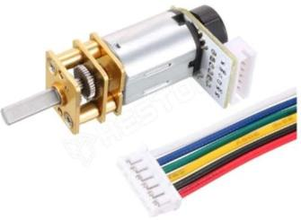
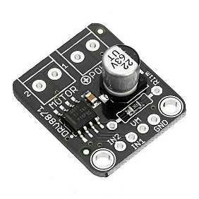
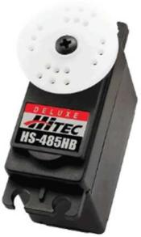

# Drive System

### DC Motor: N20E-12-500

<table>
<tr>
<td valign="top">

| Specs | Value |
|---|---|
| Voltage | 12 V |
| Speed | 500 RPM |
| Torque | 41 mNm |
| Current | 100 mA |
| Dimensions | 26 × 10 × 12 mm |
| Shaft | 3 mm diameter, D-spring contact interface |

</td>
<td valign="top" width="240"></td>
</tr>
</table>

Due to its compact size and adequate torque, the N20E motor was selected to drive the robot; it features a built-in encoder to provide precise feedback. The motor connects via a 3D-printed axle to the LEGO gears and subsequently to the LEGO differential. The motor is mounted to the differential housing using a LEGO-style bracket, and the housing itself is secured to the baseplate with screws.

**Previous tries:** We tried another version of this motor, the N20E-12-1000, but it couldn't provide sufficient torque to move the robot consistently.

**Mounting:**
- 3 pcs M3×3×4.2 mm inserts
- 3 pcs M3×8 mm screws

### Motor Controller: DRV8871-MK

<table>
<tr>
<td valign="top">

| Specs | Value |
|---|---|
| Voltage | 6.5 – 45 V |
| Max. current | 3.6 A |
| Dimensions | 25 × 21 × 9.5 mm |

</td>
<td valign="top" width="240"></td>
</tr>
</table>

The DRV8871-MK is a DC motor driver used to control the speed, direction, and braking of the DC motor.

**Previous ideas:** We tried the L298N motor driver, however it was proven to be overkill for our project. That controller can manage 2 DC motors at the same time and it's also huge in size compared to the DRV8871 and our robot's size.

**Mounting:**
- 2 pcs M2×10 mm screws
- 2 pcs M2 nuts

### Servo: HS-485HB

<table>
<tr>
<td valign="top">

| Specs | Value |
|---|---|
| Voltage | 4.8 – 6 V |
| Speed (60°) | 0.22 – 0.18 s |
| Torque range | 4.8 – 6 kg·cm |
| Current draw (idle) | 10 mA |
| Stall current draw | 1200 mA |
| Dimensions | 39.8 × 19.8 × 38.0 mm |
| Weight | 45 g |

</td>
<td valign="top" width="240"></td>
</tr>
</table>

The HS-485HB is a small servo motor that has enough torque to move our steering mechanism and is small enough to fit on the front of the robot.

**Mounting:**
- Servo mount: 2 pcs M4×5×5 mm inserts, 2 pcs M4×8 mm screws
- Servo motor: 2 pcs M4×6×5 mm inserts, 2 pcs M4×6 mm screws
