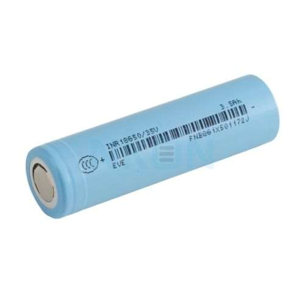
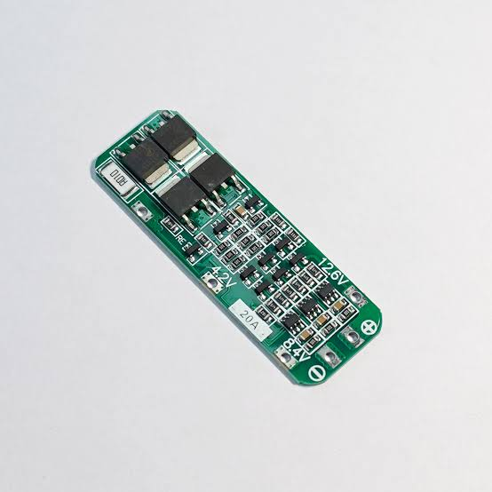
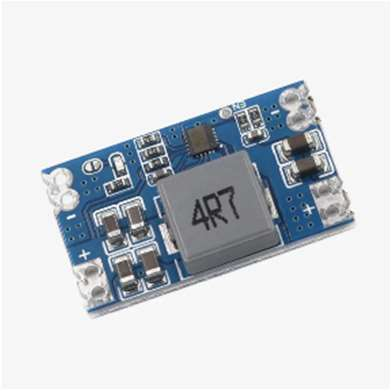
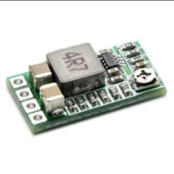

# Power and Electronics

### Power Source: EVE INR18650 + BMS 3S 20A

<table>
<tr>
<td valign="top">

| Battery Specs | Value |
|---|---|
| Capacity | 3500 mAh |
| Current | 10 A |
| Voltage | 4.2 V |
| Nominal voltage | 3.7 V |
| Dimensions | 59 × 20 × 3.7 mm |
| Max. pulse current | 20 A |

</td>
<td valign="top" width="240"></td>
<td valign="top" width="240"></td>
</tr>
</table>

**BMS specs:** Protection against overcurrent, over-discharge, overcharge, and short circuit. Operating current: 10 A.

The robot's power supply is provided by a custom-built, series-connected (3S1P) battery pack consisting of three 18650 cells. A BMS is integrated into the system to ensure stable output voltage and current, while protecting the cells and the circuit against overcurrent, over-discharge, overcharge, and short circuits. The Raspberry Pi 5 requires 5V and 5A to operate, its power supply is managed by an MINI560-5V-5A step-down converter. The camera, LiDAR, and Arduino receive their power directly from the Raspberry Pi via USB ports. The servomotor is powered by a separate DSN-1504 converter, with its output set to approximately 5V. The other electronic components receive power from the Arduino's pins.

**Mounting:**
- 4 pcs M3×5×4.2 mm inserts
- 4 pcs M3×8 screws
- 4 pcs M3×4×4.2 mm inserts
- 4 pcs M3×6 screws

### Stepdown: MINI560-5V-5A

<table>
<tr>
<td valign="top">

| Specs | Value |
|---|---|
| Input voltage | 4 – 36 V |
| Output voltage | 5 V |
| Current | 5 A |
| Dimensions | 29 × 18 × 5.4 mm |

</td>
<td valign="top" width="240"></td>
</tr>
</table>

This stepdown is used for the Raspberry Pi 5 to supply 5 V and 5 A for it.

**Previous tries:** The XL4015-STDN-PSU DC-DC converter was unable to supply sufficient current to meet the demands of the Raspberry Pi. This power deficit resulted in voltage drops, triggering unstable behavior and intermittent, random system shutdowns.

**Mounting:**
- 2 pcs M3×5×4.2 mm inserts
- 2 pcs M3×8 mm screws
- 2 pcs M2.5×4×3.5 mm inserts
- 2 pcs M2.5×10 mm screws

### Stepdown: DSN-1504-3A

<table>
<tr>
<td valign="top">

| Specs | Value |
|---|---|
| Input voltage | 4.5 – 20 V |
| Output voltage | 0.8 – 18 V |
| Current | 3 A |
| Dimensions | 22 × 17 × 4 mm |

</td>
<td valign="top" width="240"></td>
</tr>
</table>

This stepdown is used for the servo motor to supply sufficient power for it.

**Mounting:**
- 2 pcs M3×3×4.2 mm inserts
- 2 pcs M3×6 mm screws
