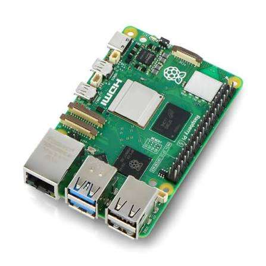
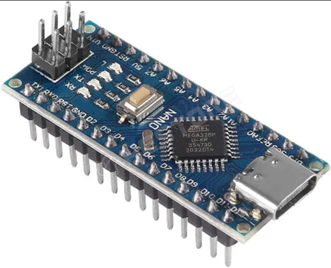

# Processing Units

### Raspberry Pi 5 (8 GB)

<table>
<tr>
<td valign="top">

| Specs | Value |
|---|---|
| Voltage | 5 V |
| RAM | 8 GB |
| Processor | ARM Cortex-A76 |
| Ports (used) | 2× USB 3.0, 1× USB 2.0 |
| Dimensions | 85 × 56 × 17 mm |

</td>
<td valign="top" width="240"></td>
</tr>
</table>

The Raspberry Pi 5 serves as our main computational unit. It processes real-time LIDAR and camera data and manages tasks like mapping and path planning.

**Mounting:**
- 4 pcs M2.5×8 mm screws
- 4 pcs M2.5×5×3.5 mm inserts

### Arduino Nano: AR-NANOCH-UNS-TYPE-C

<table>
<tr>
<td valign="top">

| Specs | Value |
|---|---|
| Microcontroller | Atmel Atmega32 |
| Voltage | 5 V |
| Dimensions | 45 × 18 mm |

</td>
<td valign="top" width="240"></td>
</tr>
</table>

The Arduino Nano serves as our secondary controller managing tasks such as motor control, servo steering and sensor inputs. It communicates with the Raspberry Pi 5 to ensure maximum control.

**Mounting:**
- 2 pcs M3×3×4.2 mm inserts
- 2 pcs M3×6 mm screws

**Previous ideas:** Level shifter (LS-BIDI-4) → USB. Previously the Raspberry and the Arduino communicated via a level shifter inside the robot, however it required 10 cables in total to connect them. So to save space and make it easier to take apart the robot we switched to a USB cable.
