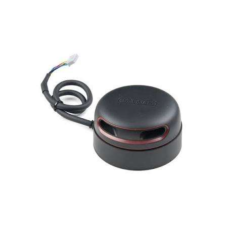
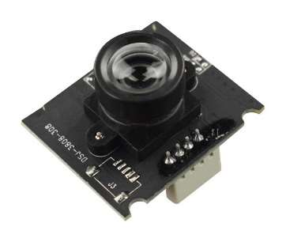
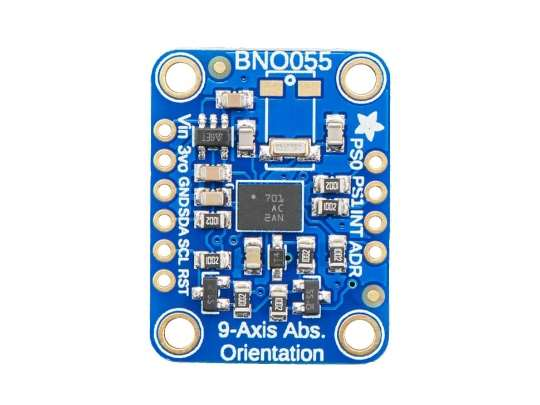

# Sensors

### LiDAR: RPLIDAR A2M8

<table>
<tr>
<td valign="top">

| Specs | Value |
|---|---|
| Distance range | 0.15 – 12 m |
| Sampling frequency | 8 kHz |
| Scan rate | Adjustable from 5 to 15 Hz |
| Angular range | 360° |
| Angular resolution | 0.9° |
| Dimensions | 76 × 76 × 41 mm |
| Weight | 190 g (sensor core) |

</td>
<td valign="top" width="240"></td>
</tr>
</table>

This LIDAR allows us to make precise measurements of obstacles around the robot. The high sampling frequency allows real-time mapping and obstacle avoidance.

**Previous tries:** The RPLIDAR A3M1 LiDAR sensor did not provide sufficient point cloud density; consequently, precise navigation would not have been feasible due to the lack of detailed data.

**Mounting:**
- 4 pcs M3×8mm screws

### Camera: DFRobot FIT0701

<table>
<tr>
<td valign="top">

| Specs | Value |
|---|---|
| Voltage | 5V |
| Resolution | 640 × 480 px |
| Dimensions | 30 × 25 × 21.4 mm |

</td>
<td valign="top" width="240"></td>
</tr>
</table>

The camera is used for obstacle and color detection.

**Mounting:**
- 2 pcs M3×5×4.2 inserts
- 2 pcs M3×8 mm screws
- 2 pcs M2.5×5×3.5 mm inserts
- 2 pcs M2.5×8 mm screws

### IMU: BNO055

<table>
<tr>
<td valign="top">

| Specs | Value |
|---|---|
| Type | 9-axis IMU |
| Voltage | 3.3 V |
| Communication interface | I²C |

</td>
<td valign="top" width="240"></td>
</tr>
</table>

The BNO055 provides real-time positional data, which helps the robot maintain correct direction and smooth out steering adjustments.

**Mounting:**
- 4 pcs M2×10 mm screw
- 4 pcs M2 nut
