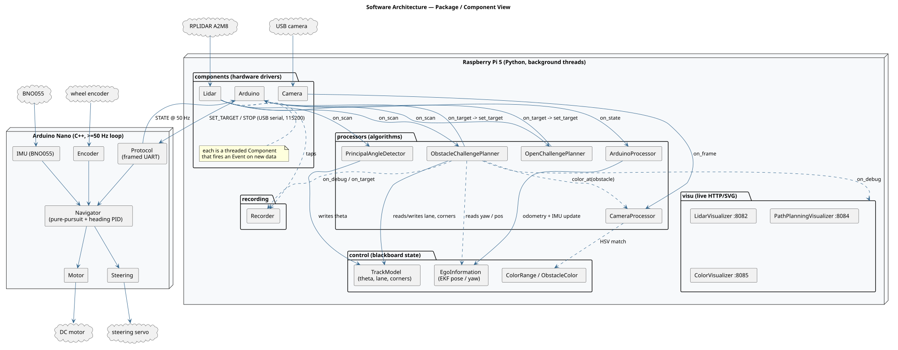
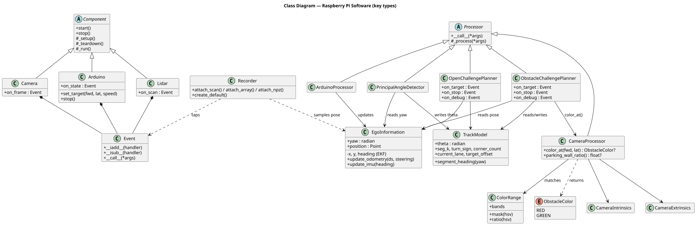
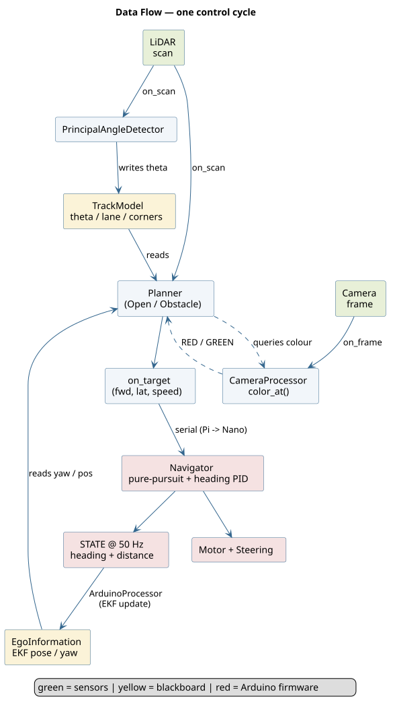

# Software Architecture

This is the high-level map of team Bits' software. It explains how the pieces fit
together; each subsystem then has its own chapter **next to the code it describes** (linked
below). For the algorithms we tried and dropped along the way, see
[Previous approaches](previous-approaches.md). To set up and run the robot, see the
[Developer & setup guide](setup-guide.md).

## Two processors, one clean boundary

The robot runs on two processors split by responsibility:

- **Raspberry Pi 5** — perception and decision making. Reads the LiDAR and camera, tracks
  the robot's heading and lane, decides where to go, and sends a motion target. Written in
  Python with background threads. *(C++ appears only in the firmware below.)*
- **Arduino Nano** — real-time motion execution. Owns the BNO055 IMU and the wheel encoder,
  and runs a tight control loop (≥ 50 Hz) that drives the motor and steering toward the
  target it was given.

The split exists because smooth motion control needs deterministic timing that a
general-purpose OS cannot guarantee, while perception and planning need CPU and libraries
the Arduino does not have. The Pi thinks; the Nano drives.

## The blackboard + event model (Raspberry Pi)

The Pi side is built from three kinds of object and one piece of glue:

| Kind | Role | Chapter |
|---|---|---|
| **Component** | hardware driver — runs a background thread, fires an `Event` on new data | [`src/rpi/components/`](../../src/rpi/components/README.md) |
| **Processor** | algorithm — subscribes to an `Event`, turns raw data into decisions/state | [`src/rpi/processors/`](../../src/rpi/processors/README.md) |
| **control** | the *blackboard* — thread-safe shared state everyone reads and writes | [`src/rpi/control/`](../../src/rpi/control/README.md) |
| **Event** | a tiny observer primitive (`+=` to subscribe, `handler(...)` to fire) | `src/rpi/utils/Event.py` |

**Event system.** Components never call processors directly. Each component exposes an
`Event` (`Lidar.on_scan`, `Camera.on_frame`, `Arduino.on_state`) and fires it when new data
arrives. Processors subscribe with `event += handler`. This decouples producers from
consumers and lets several consumers share one signal — the visualizers and the `Recorder`
simply subscribe to the *same* events as the planner, so nothing in the hot path knows they
exist. Handlers fire **synchronously, in subscription order, on the producer's thread**;
that ordering is load-bearing in one place (see below).

**Blackboard.** Shared state lives in `control/` — `EgoInformation` (the EKF pose/heading)
and `TrackModel` (principal angle, lane, corner count). Sensor threads write to it; the
planner reads from it. Every accessor takes a lock for only the microseconds it takes to
copy a few scalars — never during computation — so each thread runs at its own natural rate
without blocking the others.

## Thread & timing model

| Thread | Rate | Fires | Feeds |
|---|---|---|---|
| LiDAR | ~7 Hz (full rotations) | `Lidar.on_scan` | `PrincipalAngleDetector` → `TrackModel`, then the planner |
| Camera | up to 30 fps | `Camera.on_frame` | `CameraProcessor` (keeps the latest frame for on-demand colour reads) |
| Arduino serial reader | 50 Hz (STATE frames) | `Arduino.on_state` | `ArduinoProcessor` → `EgoInformation` |
| Recorder writer | drains a queue | — | one HDF5 file |

The planner is **driven by the LiDAR scan**, not a fixed clock: one scan is one decision.
On the LiDAR thread, `PrincipalAngleDetector` is subscribed **before** the planner, so it
refreshes the track's principal angle `theta` into `TrackModel` and the planner reads a
fresh value the same scan. That is the one place the synchronous, in-order event dispatch
matters.

## Data flow

The Pi's job each scan boils down to choosing a **body-frame aim point** `(forward_mm,
lateral_mm)` and a `speed`. The firmware's `Navigator` does its own pure-pursuit and
heading-hold PID to reach it — so the Pi never computes a steering angle directly, and a
negative `speed` simply means *reverse*.

## Coordinate systems

- **Body frame** (the interface between Pi and Arduino): origin at the rear axle,
  **+forward** is the direction of travel, **+lateral is to the robot's right**. Both
  `set_target` and the camera projection use this frame.
- **Gyro heading `yaw`**: radians, wrapped to `(−π, π]`, zeroed at an *arbitrary* placement
  angle when the BNO055 boots — so `yaw = 0` is **not** assumed parallel to the track.
- **Principal angle `theta`**: the track's grid orientation, mod 90°, fit from the LiDAR
  walls. `segment_heading = theta + k·90°` is what the straight is driven along; this is how
  the planner recovers "parallel to the wall" from an arbitrary gyro zero. See the
  [processors chapter](../../src/rpi/processors/README.md).

> The robot keeps **no map and no world (x, y) position** for navigation. Everything is
> reactive: the current scan, the gyro heading, the wheel odometry, and a per-pillar camera
> colour read. This is a deliberate choice — see [Previous approaches](previous-approaches.md)
> for the occupancy-grid/SLAM stack it replaced.

## Two entry points

| Script | Challenge | Wiring |
|---|---|---|
| `src/rpi/main_open.py` | Open (no obstacles) | Lidar + Arduino + `PrincipalAngleDetector` + `OpenChallengePlanner` |
| `src/rpi/main_obstacle.py` | Obstacle (pillars, parking) | the above + Camera + `CameraProcessor` + `ObstacleChallengePlanner` |

Both share the same components, blackboard, recording, and visualizers; they differ only in
which planner is wired in. The general algorithm both run is a state machine over the four
straights and four corners of the loop — documented, with its diagram, in the
[processors chapter](../../src/rpi/processors/README.md).

## Chapter index

- [Components](../../src/rpi/components/README.md) — LiDAR, camera, and Arduino drivers
- [Control / blackboard](../../src/rpi/control/README.md) — `EgoInformation`, `TrackModel`, colour types
- [Processors & the planning algorithm](../../src/rpi/processors/README.md) — the state machine
- [Recording & replay](../../src/rpi/recording/README.md) — the HDF5 signal recorder
- [Visualizers](../../src/rpi/visu/README.md) — live LiDAR / planner / colour views
- [Arduino firmware](../../src/arduino/README.md) — Navigator, Motor, Steering, Encoder, IMU, Protocol
- [Calibration](../../calibration/README.md) — camera, colours, steering, odometry/IMU noise
- [Previous approaches](previous-approaches.md) — what we tried and dropped
- [Developer & setup guide](setup-guide.md) — flashing, running, SSH, recording
