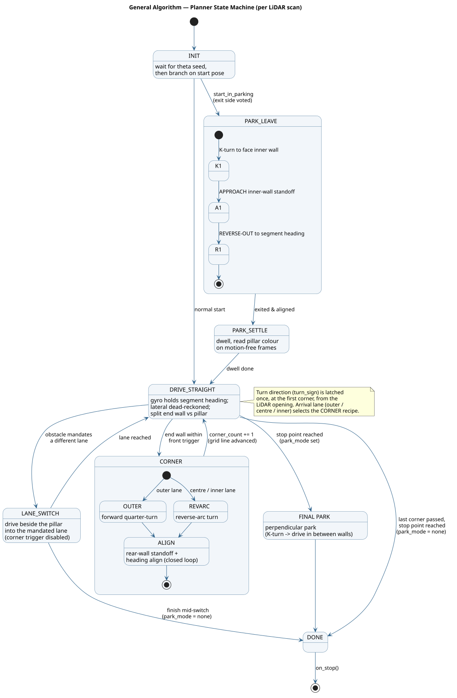

# Processors & the planning algorithm

Processors are the algorithms. Each subscribes to a component [`Event`](../utils/Event.py),
and inherits from [`Processor`](Processor.py) — a thin base whose `__call__` forwards to
`_process(...)` (and can be paused). This chapter covers the perception processors and then
the heart of the robot: the **reactive segment planner** and its state machine.

For how these wire into the rest of the system, see the
[architecture overview](../../../docs/software/architecture.md). For the ideas we tried
first (occupancy grid, SLAM, follow-the-gap), see
[Previous approaches](../../../docs/software/previous-approaches.md).

## Perception processors

- **[`ArduinoProcessor`](ArduinoProcessor.py)** — subscribes to `Arduino.on_state`. On each
  `STATE` frame it feeds `EgoInformation`: an odometry predict step (if the robot moved ≥
  0.5 mm) and an IMU heading correction. This is the only writer of the EKF pose.
- **[`CameraProcessor`](CameraProcessor.py)** — the **stateless, body-frame pillar-colour
  reader**. It keeps the latest camera frame and, on demand, answers
  `color_at(forward, lateral)`: project a body-frame point into the image through the camera
  intrinsics/extrinsics, sample a 20 px HSV patch, and classify it against the red/green
  [`ColorRange`s](../control/README.md). Because the extrinsics are body-relative, **no ego
  pose is involved** — the planner clusters a pillar in the *current* scan and hands its
  body point straight over. `parking_wall_ratio()` (whole-frame magenta) is used once at a
  parking-slot start. It also defines `CameraIntrinsics` / `CameraExtrinsics`.
- **[`PrincipalAngleDetector`](PrincipalAngleDetector.py)** — fits the track's principal
  angle `theta` each scan and publishes it to [`TrackModel`](../control/README.md); detailed
  below.

## The core idea

The planner is **deterministic, reactive, and sensor-only**. It *assumes* the WRO layout — a
rectangular loop of four straights joined by four 90° corners — and trades that assumption
for determinism. It keeps no occupancy grid, no world position, and no obstacle map. Two
principles carry the whole thing:

1. **Open-loop straights, closed-loop corners.** A straight is driven with **no lateral wall
   term**: the firmware holds heading toward an aim point placed down the segment, and
   lateral position is dead-reckoned from encoder + gyro. Every corner ends with a
   closed-loop **reset** (align to the new segment against the LiDAR rear wall). So lateral
   error can build up over at most *one* straight and is wiped at each corner — it never
   compounds across the three laps. This is also why the receding inner wall near a corner
   never corrupts anything: the straight simply does not look at the side walls.

2. **Gyro holds heading; LiDAR calibrates what "parallel" means.** The IMU zero is an
   arbitrary placement angle, so `yaw = 0` is not "parallel to the wall". The principal
   angle `theta` (grid orientation, mod 90°) is fit from the wall points; the current
   `segment_heading = theta + seg_k·90°` is what the straight is driven along. `theta` is
   yaw-invariant, so it stays valid through lane switches and corners.

Each scan the planner outputs just a body-frame aim point + speed; the firmware's
`Navigator` turns that into steering and motor commands (see the
[firmware chapter](../../arduino/README.md)).

## Principal angle `theta`

`PrincipalAngleDetector` estimates the grid orientation from **wall tangents**: between two
consecutive LiDAR returns on the same surface, the segment direction is a wall tangent. Both
corridor side walls and the perpendicular end wall lie on the same 90° grid, so every clean
tangent reinforces the same mod-90 angle. Tangents are accumulated as unit vectors on
`4·angle` (which handles the mod-90 wrap), length-weighted; the resultant length doubles as
a **fit-quality gate** — messy, mid-turn scans (low resultant) are skipped, clean straights
absorbed into a circular-mean EMA. The body-frame result is lifted into the absolute frame
with the gyro yaw, which is what makes `theta` yaw-invariant.

Because a corner start cannot produce a clean fit, if no LiDAR fit lands within
`_SEED_FALLBACK_SCANS` (12) scans the detector **seeds `theta` from the gyro** so the robot
can start moving; the EMA then refines it once a straight is in view. The detector is wired
**before** the planner on the LiDAR thread, so the planner reads a fresh `theta` the same
scan.

## The state machine

One LiDAR scan is one tick of the machine. `ObstacleChallengePlanner` implements the full
version below; `OpenChallengePlanner` is the same minus `LANE_SWITCH` and the parking states.

| State | What it does |
|---|---|
| `INIT` | wait until `theta` seeds, then branch: normal start → `DRIVE_STRAIGHT`; `--parking-start` → `PARK_LEAVE` (after voting the exit side) |
| `DRIVE_STRAIGHT` | hold `segment_heading`; split the forward cone into end wall vs pillar; apply the sticky lane; arm a corner when the end wall crosses the trigger |
| `LANE_SWITCH` | drive to a point beside the pillar in the mandated lane (corner trigger disabled so the switch always finishes) |
| `CORNER` | play a scripted, arrival-lane-specific recipe (below) |
| `PARK_LEAVE` | 3-step maneuver out of the parking slot: K-turn → approach inner wall → reverse-out to the segment |
| `PARK_SETTLE` | dwell, reading the first pillar's colour on motion-free frames before driving |
| `PARK` | final parking at the end of the run (`--park-mode perpendicular`) |
| `DONE` | stopped (`on_stop()` fired) |

### Straights and the sticky lane

There are three lanes: left / centre / right = corridor centre ± `_LANE_OFFSET` (300 mm). A
lane is **held** even when off-centre; it changes only when a pillar mandates it (WRO rule:
red → pass on its right, green → on its left). The forward cone is re-aimed away from the
near wall in proportion to the current lane, so a wall the robot is hugging is not misread as
a pillar. The end-wall distance is a high percentile of the cone (ignoring a nearer pillar);
a compact cluster well in front of the end wall is the pillar.

### Obstacle colour: read once, remember

A pillar's colour is resolved by a short **majority vote** over camera reads (so one bad
frame can't flip the lane), then **stored** keyed by `(segment, distance-from-end-wall)`. On
later laps a re-detected pillar within tolerance **recalls** the stored colour, so the lane
is correct even if the camera misreads that pass. On the start straight a "free-standing"
test rejects the magenta parking wall (continuous with the perimeter) so it is never treated
as a pillar.

### Corners: three recipes by arrival lane

`turn_sign` (CW/CCW) is latched once, at the first corner, from the LiDAR opening — deferred
until one side is genuinely open so a lane-hugging robot can't pick the wrong way early. The
arrival lane then selects the recipe, each ending in the **same** closed-loop rear-wall
align/standoff step:

| Arrival lane | Recipe |
|---|---|
| **outer** (opposite the turn) | forward quarter-turn → rear-wall align |
| **centre / inner** (turn side) | reverse-arc turn (rotate while backing) → rear-wall align |

Each arc is gyro-terminated a **lead angle** before the target so the robot's coast lands it
on target (the firmware never decelerates the arc under per-scan re-emit); the rear-wall step
then closes the loop on both heading and standoff. Every reverse target is passed through
`_make_reachable`, which snaps an in-circle target onto the minimum-turn-radius circle so the
firmware cannot silently reject it.

### Lane switches

A switch drives to a point **beside the pillar** — forward = the pillar's longitudinal
distance (latched, then coasted on odometry once it leaves the cone), lateral = the mandated
lane. The bearing is capped well short of 45°; a sharper target is pushed farther ahead
instead of aimed sideways, preserving forward progress. It completes only when the lane is
actually reached.

### Parking

`main_obstacle.py` supports a parking-slot **start** (`--parking-start`, plays the
`PARK_LEAVE` maneuver) and a final **park** (`--park-mode perpendicular`: K-turn to face the
outer wall, then drive in between the two parking walls and stop when flanked, with a hard
wall-clock timeout so a stall can never loop). The parallel-parking variants are stubs.

## `OpenChallengePlanner` — [`OpenChallengePlanner.py`](OpenChallengePlanner.py)

The open challenge has no pillars, no parking, and no lane choices, so this is a deliberately
stripped sibling: follow the segment's principal angle, and do the **outer** forward-turn
corner at every wall. The corner constants are copied verbatim from the obstacle planner, so
the tuning matches. It is a standalone duplicate rather than a subclass (the shared
primitives could be factored into a base later), and it emits the identical
`on_target` / `on_stop` / `on_debug` contract, so the recorder and visualizers work unchanged.

## Tuning surface

Nearly every threshold is a named class constant at the top of
[`ObstacleChallengePlanner.py`](ObstacleChallengePlanner.py) with a comment explaining it.
The corners are not symmetric (left vs right servo/steer trim differs), so the front triggers
and parking standoffs are **split by track direction** (`_CW` / `_CCW`) — tune each side on
its own.
